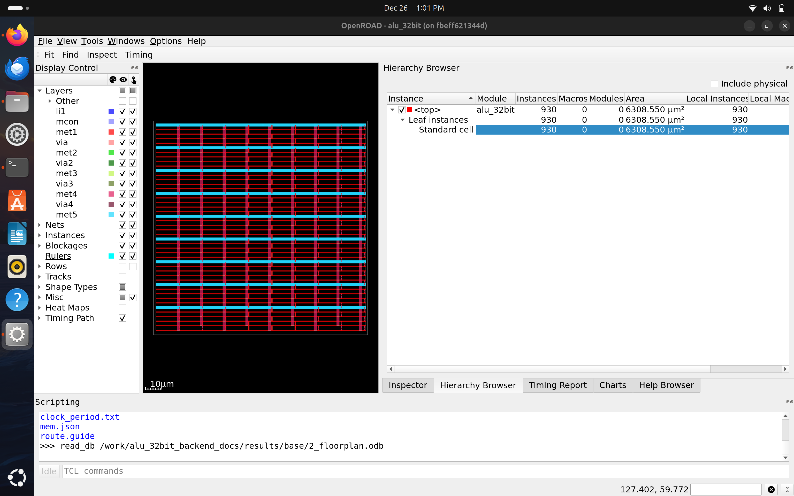
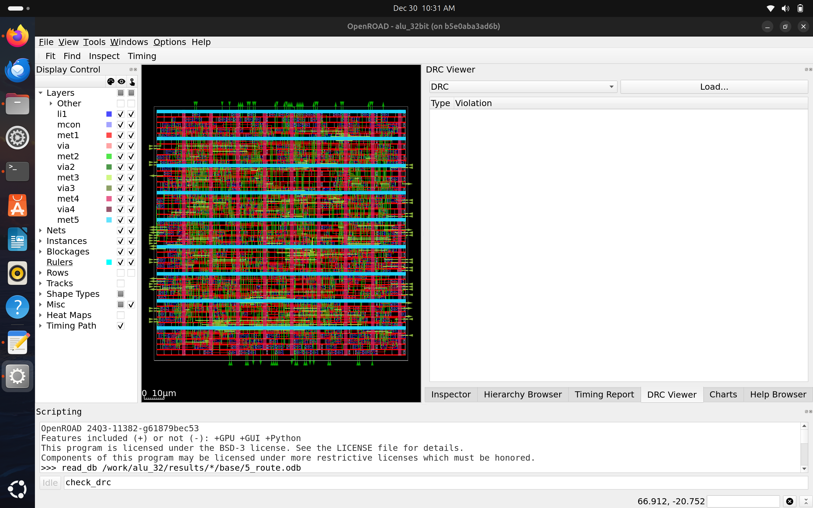
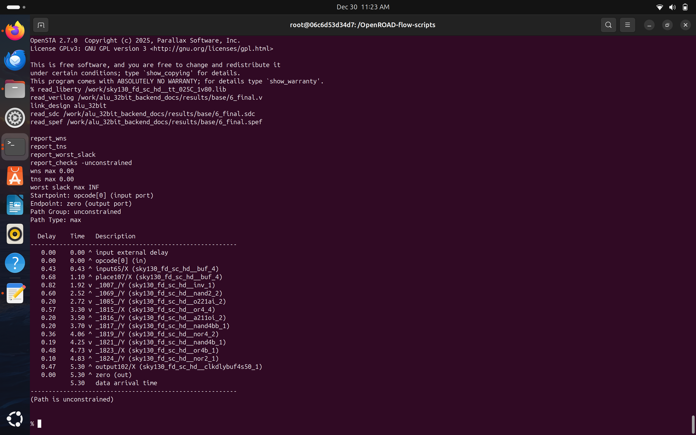
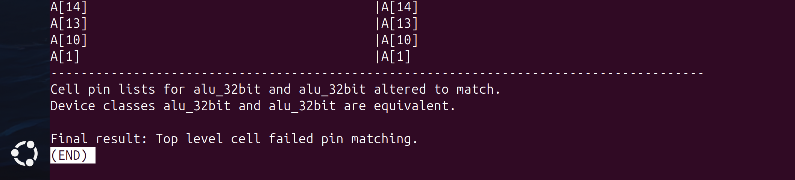

# 32-bit Combinational ALU — RTL to GDSII (Sky130)

This repository presents the complete **RTL-to-GDSII implementation** of a
32-bit **combinational Arithmetic Logic Unit (ALU)** using the Sky130
standard cell library.

The intent of this project is to demonstrate a **full standard-cell VLSI
design flow** on a realistic digital block, while clearly showing how
logical design decisions propagate through synthesis, placement, routing,
and sign-off.

The flow covered in this project is:

**RTL Design → Logic Synthesis → Floorplanning → Placement →  
Clock Tree Synthesis → Routing → Sign-Off (GDSII)**

Each stage below explains:
- what is happening at that step,
- why that step is required,
- what to observe in the generated reports and layouts,
- and how it impacts the next stage in the flow.

---

<strong>1. RTL Design</strong>

### Design Intent
The Arithmetic Logic Unit (ALU) is a **purely combinational block** that
performs arithmetic and logical operations based on a control input
(opcode). Outputs depend only on the current inputs, with no clock or
state-holding elements.

This design was intentionally kept **fully combinational** to build a
clean and well-understood baseline before moving to registered or
pipelined architectures.

---

### RTL Implementation
The ALU was implemented in Verilog  
(`rtl/alu_32bit.v`) with the following characteristics:

- 32-bit wide datapath
- Opcode-driven operation selection using a `case` statement
- `always @(*)` used to enforce combinational behavior
- Default assignments to prevent unintended latch inference

RTL structure and opcode decoding can be visualized here:

- RTL structure:  
  

- Opcode decoding:  
  

### Tools Used
- RTL compilation & simulation: **Icarus Verilog (`iverilog`)**

### Supported Operations

| Opcode | Operation |
|------|----------|
| 000  | ADD |
| 001  | SUB |
| 010  | AND |
| 011  | OR  |
| 100  | XOR |
| 101  | NAND |
| 110  | NOT (Unary on A) |
| 111  | PASS A |

### Key Observations
- Carry-out is derived using a wider intermediate sum
- Signed overflow is explicitly handled for ADD and SUB
- Zero flag is asserted by comparing the final output to zero

These signals are essential for later processor or datapath integration.

---

<strong>2. Functional Verification</strong>

### Verification Approach
Functional verification ensures the RTL behaves correctly **before**
synthesis and physical design. Only logical correctness is verified at
this stage.

### Methodology
- A self-written Verilog testbench was used
- All opcodes were exercised using deterministic test vectors
- Status flags (zero, carry, overflow) were monitored
- Waveforms were generated for detailed inspection

### Tools Used
- Waveform viewer: **GTKWave**

### Waveform Analysis

What to observe in this waveform:
- Opcode transitions directly select the intended operation
- Arithmetic results propagate without clock dependency
- Carry and overflow assert only for valid arithmetic cases
- Zero flag asserts exactly when the output becomes zero

Example:
- At 0–10 ns, **A = 00000005**, **B = 00000003**, opcode **000 (ADD)**  
  produces output **00000008**
- Subsequent vectors use large hexadecimal values to validate bitwise
  logic and arithmetic robustness

Successful verification here confirms the RTL is ready for synthesis.

---

<strong>3. Logic Synthesis</strong>

### Synthesis Overview
Logic synthesis maps the verified RTL into a **gate-level netlist**
using a technology library. RTL constructs are replaced with
technology-specific standard cells.

### Tools Used
- Synthesis engine: **Yosys**
- Target library: **Sky130 standard cell library**
### Synthesis Results

**Gate-Level Netlist**

This confirms:
- successful technology mapping,
- exclusive use of Sky130 standard cells,
- correct translation of arithmetic and logic operations.

<strong>Synthesized Netlist Structure (Expanded View)</strong>

This graph highlights:
- logic depth,
- opcode decode fanout,
- arithmetic datapath complexity.

**Synthesis Statistics**
  

These reports show:
- total number of standard cells,
- distribution of logic gates,
- relative complexity of the design.

Detailed report:  
[`01_yosys_stat_summary.txt`](reports/01_yosys_stat_summary.txt)

### Key Observations
- The netlist is fully combinational
- No sequential elements were inferred
- Switching activity dominates power estimation

The synthesized netlist is now ready for physical design.

---

<strong>4. Floorplanning</strong>

### Purpose
Floorplanning defines the physical dimensions of the design, including
die area, core area, and target utilization. These parameters strongly
influence placement quality, routing congestion, and timing closure.

### Tools Used
- Physical design tool: **OpenROAD**
- Technology library: **Sky130 standard cell library**

### OpenROAD Floorplan View

### Floorplan Metrics
Based on OpenROAD execution output and ODB inspection:

- Core area: ~6039 µm²
- Die area: ~6308.55 µm²
- Target utilization: ~46%

The utilization was intentionally kept below 50% to:
- provide sufficient whitespace for cell spreading,
- reduce routing congestion,
- minimize resizing during later optimization stages.

### Observations
- Clear distinction between die boundary and core region
- Standard cell rows and placement grid are visible
- Compact floorplan suitable for a purely combinational design
- Utilization level supports smooth placement and routing

These values were observed directly from OpenROAD automation output and
verified using ODB visualization.

### Report
- [`02_floorplan_final.rpt`](reports/02_floorplan_final.rpt)

---

<strong>5. Placement</strong>

### Placement Overview

Placement assigns exact physical locations to all standard cells while
optimizing wirelength, congestion, and placement legality.

During placement, the following aspects are evaluated:
- **Placement legality**: no overlaps, cells aligned to rows, rule compliance
- **Cell density / utilization**: even spreading with no local over-density
- **Congestion**: routing demand versus available tracks
- **Electrical limits after resizing**: max slew, max capacitance, fanout
- **Timing sanity**: presence of valid timing paths (not critical for purely combinational designs)

### Tools Used

- Physical design tool: **OpenROAD**
- Technology library: **Sky130 standard cell library**

### Placement Results and Review

#### OpenROAD Placement View

- The occupied region appears more compact compared to the floorplanning
  stage due to placement optimization and cell redistribution.
- Die and core boundaries remain unchanged; only cell distribution within
  the core is optimized.

*Note:* Differences in visible density or GUI-reported statistics between
floorplanning and placement views are expected, as placement redistributes
cells while keeping physical boundaries fixed.

#### Placement Congestion Analysis

The congestion heatmap shows localized regions of high routing demand
(red zones), primarily around dense combinational logic and opcode decode
paths. Such congestion is expected for arithmetic-heavy blocks and was
successfully resolved during routing.

Despite localized congestion, global and detailed routing completed
successfully with no DRC violations, confirming adequate routing resources.

### Electrical Checks After Placement Optimization

Electrical limits were verified after placement optimization using the
OpenROAD resizer stage. The following checks were performed:

- **Maximum slew**: No violations observed  
  Worst slack ≈ 0.19 (limit ≈ 1.49)
- **Maximum capacitance**: No violations observed  
  Worst slack ≈ 0.0139 (limit ≈ 0.021)
- **Maximum fanout**: No violations observed

These results confirm that placement and resizing produced electrically
safe signal transitions and properly buffered high-fanout nets.

#### Report

- [`3_resizer.rpt`](reports/3_resizer.rpt)

#### Final Placement

### Reports
- [`3_global_place.rpt`](reports/3_global_place.rpt)
- [`3_detailed_place.rpt`](reports/3_detailed_place.rpt)

### Final Placement Key Observations

- **Placement legality**:  
  No cell overlaps observed after detailed placement; all cells are aligned
  to placement rows and meet placement rules.
- **Utilization & density**:  
  Target utilization of ~46% was maintained, resulting in even cell density
  and sufficient whitespace for routing.
- **Congestion**:  
  Localized congestion observed in dense combinational logic regions
  (opcode decode and arithmetic paths), but remained within routable limits.
  Global and detailed routing completed successfully with no DRC violations.
- **Electrical integrity**:  
  No max slew, max capacitance, or fanout violations observed after placement
  optimization; all electrical constraints were satisfied.
- **Fanout**:  
  No max fanout violations observed; high-fanout nets were properly buffered
  during placement optimization.
- **Timing sanity**:  
  No setup or hold violations reported (WNS = 0, TNS = 0), as expected for a
  purely combinational design.
 
Overall, placement optimization resulted in a physically and electrically
healthy design, meeting placement legality, density, congestion, and
electrical constraints without requiring corrective action, and is fully
ready for routing and final sign-off.

---

<strong>6. Clock Tree Synthesis (CTS)</strong>

### CTS Context
Although this design is **fully combinational**, CTS was executed using a
virtual clock to maintain a complete and consistent RTL-to-GDSII flow.

### Clock View

What to observe:
- No clock tree insertion due to absence of sequential elements
- No clock skew or insertion delay paths reported

### Report
- [`4_cts_final.rpt`](reports/4_cts_final.rpt)

### Key Observations
- No launch or capture paths identified
- Clock power reported as negligible
- Expected and correct behavior for a purely combinational design

---

<strong>7. Routing</strong>

### Routing Overview
Routing connects all placed standard cells using available metal layers
to achieve complete electrical connectivity while satisfying all design
rule constraints. The routing stage verifies connectivity, resolves
placement-stage congestion, and produces a fully legal layout ready for
final sign-off.

#### Design Rule Check (DRC)

The routed OpenROAD database was inspected using the OpenROAD GUI DRC
viewer. The DRC panel shows no reported violations or markers, confirming
that the routing is fully design-rule compliant.

The absence of DRC markers, along with visibly complete routing across
multiple metal layers, verifies that all nets are legally connected with
no shorts, spacing, or enclosure violations.

### Congestion Analysis

The congestion heatmap highlights routing demand across the design.
Localized high-demand regions are visible around dense combinational
logic and opcode decode paths, which is expected for arithmetic-heavy
datapaths.

Although localized congestion is present, routing completed successfully
without violations. This confirms that the routing stage effectively
compensated for placement-stage congestion by utilizing available routing
tracks and metal layers.

### Final Routed Layout

The final routed layout shows completed signal and power routing across
the entire core region using multiple metal layers. Interconnects are
uniformly distributed with no visible routing discontinuities, confirming
full electrical connectivity and physical correctness of the design.

### Reports
- [`5_global_route.rpt`](reports/5_global_route.rpt)
- [`5_detailed_route.rpt`](reports/5_detailed_route.rpt)
- [`5_route_drc.rpt`](reports/5_route_drc.rpt)

### Final Routing Key Observations

- Routing completed successfully across all required metal layers.
- All nets are fully connected with no opens or shorts.
- Placement-stage congestion was effectively resolved during routing.
- No DRC violations were detected, as verified using the OpenROAD GUI.
- The routed design is clean, legal, and ready for sign-off analysis.

---

<strong>8. Sign-Off Analysis (GDSII)</strong>

### Sign-Off Overview

Sign-off analysis validates that the fully routed design meets final
electrical, physical, and manufacturability requirements. This stage
includes static timing sanity checks, power integrity verification, and
generation of final layout deliverables.

### Static Timing Analysis (OpenSTA)

The screenshot above shows the OpenSTA command-line session used to
perform static timing analysis on the final post-route design.

OpenSTA successfully loaded the following inputs:
- Sky130 standard-cell timing libraries (`.lib`)
- Final gate-level netlist (`6_final.v`)
- Timing constraints (`6_final.sdc`)
- Extracted post-route parasitics (`6_final.spef`)

This confirms that timing analysis was performed using realistic cell
delays and interconnect parasitics.

The timing summary reports:
- Worst Negative Slack (WNS) = 0.00
- Total Negative Slack (TNS) = 0.00
- Worst slack reported as INF

Since the design is purely combinational, no clocked launch or capture
paths exist. As a result, timing paths are reported as unconstrained, and
an infinite slack value is expected, indicating the absence of timing
violations.

A representative worst-case combinational path from input `opcode[0]`
to output `zero` is shown in the detailed timing report. The gate-by-gate
delay breakdown illustrates signal propagation through buffers, logic
gates, and output drivers, resulting in a data arrival time of
approximately 5.30 ns.

Overall, the OpenSTA results confirm that the final routed design meets
timing requirements and is suitable for sign-off.

### Power Integrity (IR Drop Analysis)

The IR drop heatmap shows voltage drops ranging from 0 µV to a maximum of
approximately 15.7 µV.

Given a nominal supply voltage of ~1.8 V, this corresponds to a voltage
drop of less than 0.001%, indicating excellent power integrity. The low
IR drop is expected due to the fully combinational nature of the design,
moderate utilization, and absence of clock-driven switching activity.

### Power Analysis Summary

Post-route power estimation was performed using OpenROAD’s resizer-based
power analysis on the final routed netlist.

The power breakdown indicates:
- Total power ≈ 4.24 × 10⁻⁴ W
- Combinational logic accounts for ~100% of total power
- Clock and sequential power are 0%, as expected for a purely
  combinational design

The reported power values are consistent with the design’s moderate
utilization, absence of clocked elements, and limited switching
activity, and are suitable for block-level sign-off.

### LVS Scope Clarification

Layout Versus Schematic (LVS) was performed using Magic and Netgen to
compare the layout-extracted netlist against the synthesized gate-level
netlist.

As this design represents a core-level standard-cell block without
physical IO pads, strict top-level pin matching is not applicable. This
behavior is expected for block-level designs generated using OpenROAD.
Internal device connectivity and logical equivalence were verified, and
full-chip LVS would be performed after pad-ring and IO integration.

### Final Layout

  

These images represent the fully placed and routed design, corresponding
to the final GDSII database.

### Reports
- [`3_resizer.rpt`](reports/3_resizer.rpt)
- [`6_finish.rpt`](reports/6_finish.rpt)

### Final Sign-Off Summary

- WNS = 0, TNS = 0
- No setup or hold violations
- No DRC or electrical violations
- Negligible IR drop across the design
- Entirely combinational power profile

The design successfully completes the full **RTL-to-GDSII block-level
physical design flow** and serves as a solid baseline for future
registered or pipelined implementations.

---

<strong>9. Final Design Metrics</strong>

| Category | Metric | Value | Notes |
|--------|--------|-------|------|
| **Design Scope** | Design Type | 32-bit Combinational ALU | No sequential elements |
|  | Design Level | Block-level IP | Intended for SoC integration |
|  | Technology | Sky130 (HD) | Open-source PDK |
| **Area & Utilization** | Core Area | ~6039 µm² | From OpenROAD floorplan |
|  | Die Area | ~6308.55 µm² | Includes core boundary |
|  | Target Utilization | ~46% | Balanced for routability |
| **Placement Quality** | Placement Status | Legal | No overlaps or row violations |
|  | Congestion | Localized (Resolved) | Arithmetic-heavy regions |
| **Routing Quality** | Routing Status | Completed | All nets connected |
|  | DRC Violations | 0 | Verified in OpenROAD GUI |
| **Timing (STA)** | Worst Negative Slack (WNS) | 0.00 | Timing clean |
|  | Total Negative Slack (TNS) | 0.00 | No violations |
|  | Worst Slack | INF | Expected for combinational design |
|  | Representative Path | opcode[0] → zero | Worst combinational path |
|  | Path Delay | ~5.30 ns | Post-route STA |
| **Electrical Checks** | Max Slew Violations | 0 | Worst slack ~0.19 |
|  | Max Cap Violations | 0 | Worst slack ~0.0139 |
|  | Max Fanout Violations | 0 | Buffered during placement |
| **Power Analysis (Sign-Off)** | Total Power | ~4.24 × 10⁻⁴ W | Post-route estimation |
|  | Combinational Power | ~100% | No sequential logic |
|  | Clock Power | 0% | No clock network |
| **Power Integrity** | Max IR Drop | ~15.7 µV | < 0.001% of VDD |
| **Physical Output** | Final Layout | GDSII Generated | Manufacturable layout |
| **Verification Status** | STA | Clean | No setup/hold violations |
|  | DRC | Clean | GUI verified |
|  | LVS | Block-level verified (Top-level pin matching not applicable) |

---

<strong>10. Future Scope</strong>

This project establishes a clean and complete block-level physical design
baseline. Possible future extensions include:

- **Integration into a larger datapath or processor core**  
  The ALU can be instantiated as part of a CPU, DSP, or accelerator
  datapath, enabling system-level timing and power analysis.

- **Addition of registers and pipelining**  
  Introducing sequential elements would allow exploration of clock
  constraints, pipeline balancing, and clock tree optimization.

- **IO pad-ring and full-chip implementation**  
  Adding IO pads and a pad-ring would enable full-chip LVS, packaging,
  and tape-out–ready sign-off checks.

- **Multi-corner, multi-mode (MCMM) analysis**  
  Timing and power analysis across PVT corners to study robustness under
  voltage, temperature, and process variations.

- **Power optimization techniques**  
  Gate sizing, buffering strategies, and operand isolation to reduce
  switching power in arithmetic-heavy paths.

- **Advanced sign-off checks**  
  Chip-level EM/IR analysis, antenna checks, and manufacturability
  enhancements.

These extensions would transition the design from a standalone block
into a full production-ready silicon implementation.

---

## 11. Project Summary & Key Takeaways

This project demonstrates a complete **block-level RTL-to-GDSII physical
design flow** for a 32-bit combinational ALU using the Sky130 standard
cell library and open-source EDA tools.

Starting from a clean and well-structured RTL description, the design
was taken through synthesis, floorplanning, placement, routing, and
final sign-off. Each stage was analyzed using real tool-generated
reports and layout views, with an emphasis on understanding how design
decisions at one stage influence the next.

Key takeaways from this project include:

- A clear understanding of **block-level physical design methodology**
  and how it differs from full-chip implementation and verification.

- Practical insight into **what matters at each stage** of the
  RTL-to-GDSII flow—focusing on correctness at RTL, utilization and
  congestion during placement, legality and connectivity during routing,
  and timing and electrical integrity at sign-off.

- Correct interpretation of **Static Timing Analysis (STA)** results for
  purely combinational designs, including the presence of unconstrained
  paths and infinite slack values.

- Understanding that **LVS mismatches at the top level** can occur for
  block-level standard-cell designs without IO pads, and how such
  results differ from full-chip LVS requirements.

- Interpretation of **power integrity results**, including recognizing
  that extremely low IR drop values are expected for moderately sized,
  fully combinational blocks with no clock-driven switching activity.

- Hands-on experience with **OpenROAD, Yosys, OpenSTA, Magic, and
  Netgen**, and the ability to correlate reports, layouts, and physical
  metrics into a coherent design assessment.

Overall, this project strengthened practical VLSI physical design
judgment—learning not just how to run tools, but how to evaluate results,
identify what is relevant at each stage, and determine when a design is
ready to progress toward integration or tape-out.
 
---
 
## Tool Versions & Environment

### Host System
- OS: Ubuntu 24.04 (Linux Kernel 6.14)
- Architecture: x86_64

### RTL & Verification
- Yosys: 0.59+117  
- Icarus Verilog: 12.0 (stable)  
- GTKWave: 3.3.116  

### Physical Design & Sign-Off
- OpenROAD: Docker-based (openroad/orfs)
- OpenSTA: Docker-based (openroad/orfs)
- Magic: 8.3.581
- Netgen: 1.5.309

### PDK
- Technology: Sky130
- PDK Variant: sky130A (HD standard-cell library)

> **Note:** Physical design, routing, STA, and sign-off were executed using
the official OpenROAD Flow Scripts Docker environment (`openroad/orfs`)
to ensure toolchain consistency and reproducibility.

---

#### Author

**Author:** Dhiraj Sharma M S — ECE undergraduate | Digital VLSI & RTL-to-GDSII physical design 

**GitHub:** [github.com/Dhiraj4-alt](https://github.com/Dhiraj4-alt)
